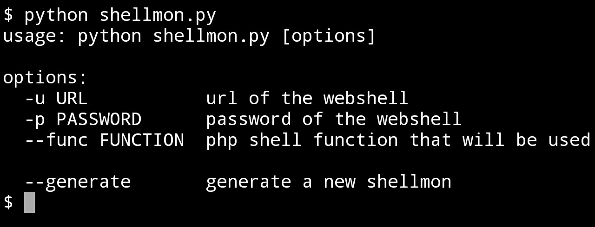
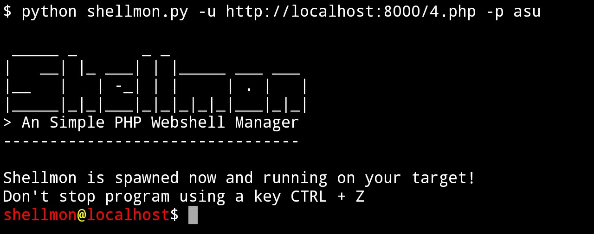

<div align="center">


> An Simple PHP Webshell Manager

</div>

## Description
Shellmon is a tool used to create and control a webshell remotely, created using the Python3 programming language using the "Object Oriented" method. The resulting webshell has been coded very simply and has a size of no more than 80 bytes. 
It provides an interactive shell in your terminal that makes it easy for you to create or control a webshell.

## Instalation
The installation process of this tool is quite easy, it does not use an external python modules that makes your computer's storage space a bit filled.

Please download this repository or you can also clone the repository using git by typing the following command in your terminal: 
```bash
git clone https://github.com/22XploiterCrew/Shellmon
```
after that move the pre-work directory in your terminal to the ***shellmon** directory.

## Usage
Simple interactive shell commands make it easy to run this tool.

type `python shellmon.py` in the terminal screen to display the help command.


If you want to generate a new webshell, you just need to type this command in the terminal
```bash
python shellmon.py -p yourpassword --generate
```
webshell files will be automatically saved in your current pre-employment directory, filenames will be auto-generated with number format 0-9 and use .php extension.

Furthermore, if you want to connect your uploaded webshell to the target server, you just need to type this command on the terminal screen
```bash
python shellmon.py -u https://target.com -p yourpassword
```
display if successfully connected

you can also customize PHP shell functions by using the `--func [function]` argument, by default the function used is ***system***.

#### Support
- 22XploiterCrew
- Banyumas Cyber Team
- Jombang BlackHat